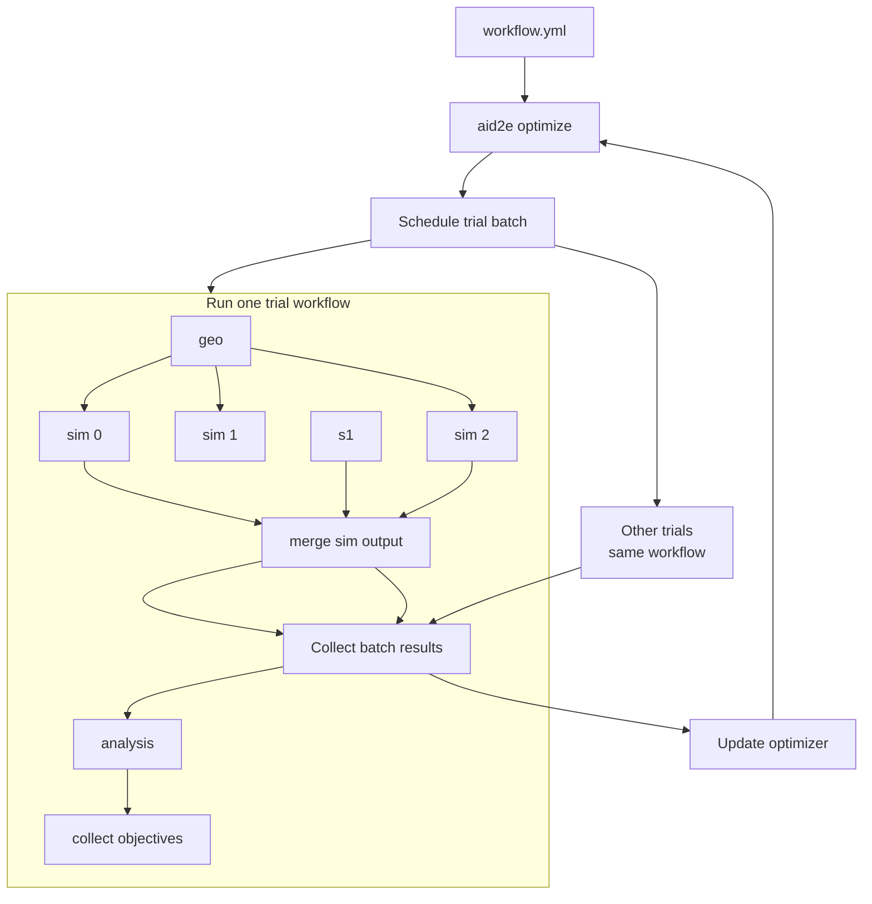

# AID2E BIC Example

Run test BIC optimization with AID2E. Illustrates these
points:
- How to define design parameters inline;
- How to run a single-objective optimization;
- How to specify inputs/outputs from different stages,
  jobs, and layers.

## Files
- `workflow.yml`: example config parameters, optimizer, scheduler, 
  and ePIC workflow.
- `submit.sh`: small script to launch an optimization via
  slurm.
- `scripts/bic_angular_reso.py`: analysis script to compute phi
  resolution
- `scripts/extract_objective.py`: helper script to extract
  phi resolution from analysis output and return it to AID2E
  in the necessary format
- `inputs/central_photons_bin*.py`: input DD4hep steering
  files defining the 3 kinematic bins used in the example.

## ePIC Setup
Works out-of-the-box with ePIC geometry. Install geometry with
```
git clone git@github.com:eic/epic.git
```
And set `epic_install` in `workflow.yml` to the relative path
to the geometry installation.

## Run
To run locally via JobLib, edit `workflow.yml` as needed
and then do:
```
aid2e optimize examples/bic/workflow.yml
```

To run via Slurm, again edit `workflow.yml` as needed (including
uncommenting the `SlurmRunner` options!) as well as `submit.sh` and
then do:
```
sbatch submit.sh
```

## Workflow

