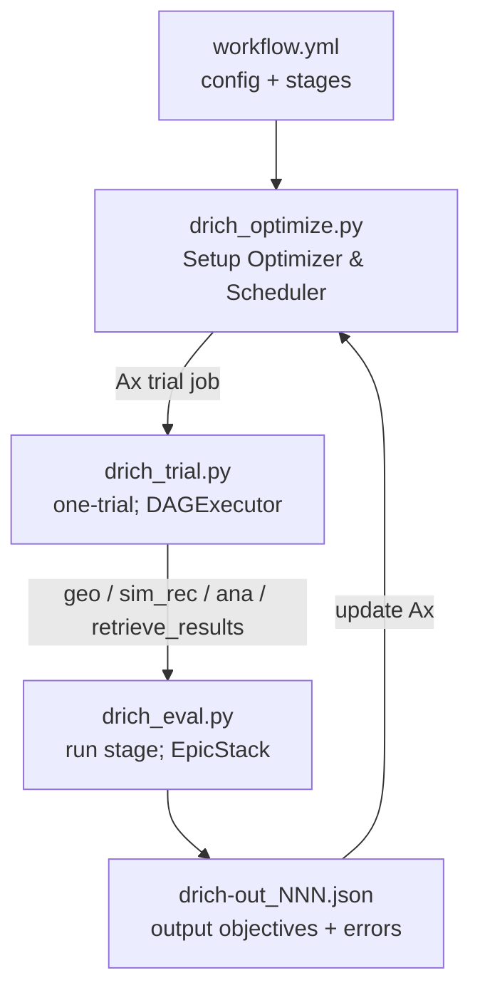

# AID2E dRICH Example

Run dRICH detector-design optimization with AID2E. The main flow is:

```text
drich_optimize.py -> drich_trial.py -> drich_eval.py -> drich-out_{trial}.json -> Ax update
```

## Files
- `workflow.yml`: example workflow config
- `design.params`: geometry parameters and XML edit targets
- `drich_optimize.py`: builds optimizer/scheduler, submits trial jobs, updates Ax, writes results
- `drich_trial.py`: builds one trial DAG from YAML stages
- `drich_eval.py`: runs stage with EpicStack
- `drich_utils.py`: additional utils
- `script/dRICHAna_bootstrap.cpp`: dRICH analysis code used by `ana`.

## ePIC Setup
It is recommended to use the branch of the fork containing a single-mirror dRICH, which is then compatible with the already built versions of EICrecon and IRT available in eic-shell:24.11.1-stable.

The following repository and branch hold the recommended default geometry for the optimization of the dRICH and will need to be downloaded and built prior to running.

Additionally, the dRICH analysis script will need to be built from within eic-shell prior to running the optimization, located in examples/drich/script

```bash
git clone -b 24.11.1-drich-singlemirror https://github.com/cpecar/epic-geom-drich-mobo.git
./build_epic.sh epic-geom-drich-mobo "$EIC_SOFTWARE"
cd examples/drich/script && make
```

## Run
```bash
python examples/drich/drich_optimize.py --config examples/drich/workflow.yml
```


