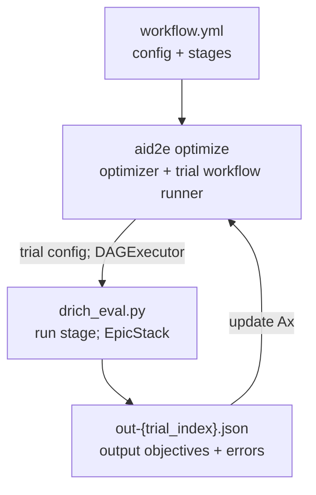

# AID2E dRICH Example

Run dRICH detector-design optimization with AID2E. The main flow is:

```
workflow.yml -> aid2e optimize -> drich_eval.py -> out-{trial}.json -> optimizer update
```

## Files
- `workflow.yml`: example config optimizer, scheduler, and epic workflow
- `design.params`: geometry parameters and XML edit targets
- `drich_eval.py`: launched by DAG stages; runs ePIC stack layers
- `drich_utils.py`: dRICH-specific utilities
- `script/dRICHAna_bootstrap.cpp`: dRICH per-scan analysis code used by the `ana` stage

## ePIC Setup
It is recommended to use the branch of the fork containing a single-mirror dRICH, which is then compatible with the already built versions of EICrecon and IRT available in eic-shell:24.11.1-stable.

The following repository and branch hold the recommended default geometry for the optimization of the dRICH and will need to be downloaded and built prior to running.

Additionally, the dRICH analysis script will need to be built from within eic-shell prior to running the optimization, located in examples/drich/script

```
git clone -b 24.11.1-drich-singlemirror https://github.com/cpecar/epic-geom-drich-mobo.git
./build_epic.sh epic-geom-drich-mobo "$EIC_SOFTWARE"
cd examples/drich/script && make
```

## Run
```
aid2e optimize examples/drich/workflow.yml
```


