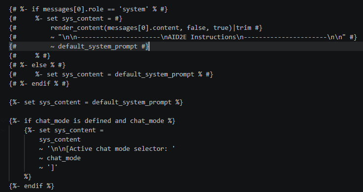
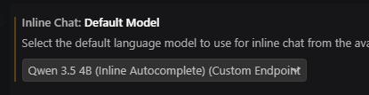
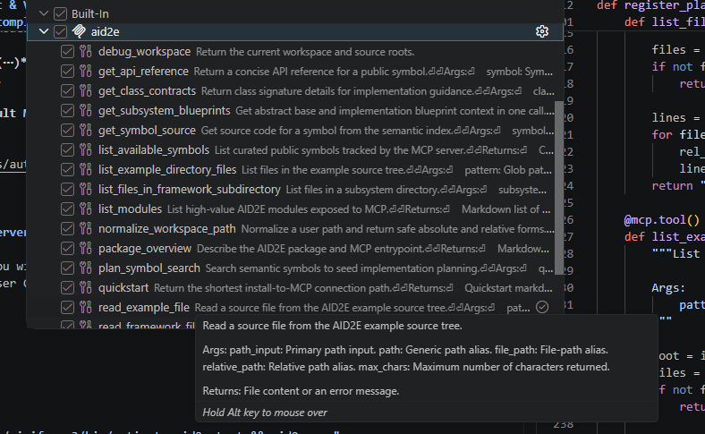

# AID2E Chatbot: Deployment & VS Code Connection Guide

This document walks through how to deploy the AID2E chat/autocomplete models and connect to them from VS Code.

---

## 1. Configuration Files

All deployment configs live here:

```
/src/aid2e/mcp/deployment/
```

In that directory you'll find:

- **`.yml` files** — deployment configs for each model (chat/agent models and the autocomplete model). I will deploy these for you, if you have any issues let me know and I can reset their state.


---

## 2. About the `.jinja` System Prompt File

The system prompt exists in:

```
/scr/aid2e/mcp/context/
```

The `.jinja` file lets you inject a custom system prompt when the model is deployed, so users don't need to set one manually in their VS Code configuration files.

A few important notes on this file:

- The **top block is commented out**. Effectively, this means `sys_content` is set to the custom prompt of your choosing.
- This also **strips the VS Code (system) prompt** — the model will use your injected prompt instead of whatever VS Code would normally send.

**For most use cases:** you likely don't need this. Simply remove the argument in the `.yml` file that passes the chat template, e.g. remove:

```
--chat_template "arg"
```

and the model will behave normally (using VS Code's own system prompt).

**If you do want a custom system prompt on top of VS Code's**, the `.jinja` file is how you achieve that — this is the mechanism to use.



---

## 3. Spawning and Forwarding the Model(s)

Once the model(s) are spawned, forward the appropriate ports over SSH:

Using the W&M VPN:
```bash
ssh -L 8000:IP_OF_CHAT_AGENT:8000 -L 8001:IP_OF_AUTO_COMPLETE:8001 username@cm.geo.sciclone.wm.edu
```
Jumping through bastion:
```bash
ssh -J username@bastion.wm.edu -L 8000:IP_OF_CHAT_AGENT:8000 -L 8001:IP_OF_AUTO_COMPLETE:8001 username@cm.geo.sciclone.wm.edu
```

- Port `8000` → chat/agent model
- Port `8001` → autocomplete model

Replace `IP_OF_CHAT_AGENT`, `IP_OF_AUTO_COMPLETE`, and `username` with your actual values.
A succesful execution will result in a login to sciclone. If the endpoints are not correctly configured in VSCode you will see output here as well.

---

## 4. Configuring `chatLanguageModels.json` in VS Code

Open the `chatLanguageModels.json` file in VS Code and set it up similar to the example below. 
ctrl + shift + p will allow you to type and search for this.

```json
[
    {
        "name": "AID2E Models",
        "vendor": "customendpoint",
        "apiType": "chat-completions",
        "models": [
            {
                "id": "Qwen/Qwen3.5-122B-A10B-FP8",
                "name": "Qwen 3.5 122B (Chat/Agent)",
                "url": "http://localhost:8000/v1/chat/completions",
                "toolCalling": true,
                "vision": false,
                "maxInputTokens": 65536,
                "maxOutputTokens": 4096
            },
            {
                "id": "Qwen/Qwen3.6-35B-A3B",
                "name": "Qwen 3.6 35B (Chat/Agent)",
                "url": "http://localhost:8000/v1/chat/completions",
                "toolCalling": true,
                "vision": false,
                "maxInputTokens": 65536,
                "maxOutputTokens": 4096
            },
            {
                "id": "Qwen/Qwen3.5-4B",
                "name": "Qwen 3.5 4B (Inline Autocomplete)",
                "url": "http://localhost:8001/v1/chat/completions",
                "toolCalling": false,
                "vision": false,
                "maxInputTokens": 16384,
                "maxOutputTokens": 2048
            }
        ]
    }
]
```

You can list multiple models here for chat — just make sure to select the one that's actually spawned on the server. Selecting a model that isn't currently running will throw an ID error. Selection is done in the same location as normal copilot models.

---

## 5. Enabling Inline Autocomplete

To get the autocompletion model working:

1. Click the **three dots (⋯)** in the top right of the chat window.
2. Go to **Chat Settings**.
3. Select **Inline Chat**.
4. Set **Inline Chat: Default Model** to the correct model (e.g., `Qwen 3.5 4B (Inline Autocomplete)`).



---

## 6. Setting up the MCP Server

To setup the MCP server, you will need to access the mcp.json file inside VSCode (ctrl + shift + p and search for MCP: Open User Configuration). You should then inject something like this:

```json
{
  "servers": {
    "aid2e": {
      "command": "bash",
      "args": [
        "-c",
        "source /home/james/miniforge3/bin/activate aid2e_test && aid2e mcp"
      ]
    }
  }
}
```

Note I am using conda to hold the AID2E environment, if you are using virtual env, UV, etc., just make sure you activate it accordingly and enable the MCP server. You will need to make sure to start the server (icon above the name once in the mcp.json file).

If the tools are enabled correctly, you will be able to see them by clicking "configure tools" beside the model name inside the chatbox.



## Notes

Please take note of how useful this is, and when it starts to break. You will notice that as context gets longer the model is going to start not using the AID2E tools for example. Also think of new tools that will be useful, you can simply tell me what these will be and I can implement them or feel free to also contribute yourself.

This is a little bit awkward in the sense that I am developing as if AID2E is a pip package. We want to perform experiments away from the actual source code. For example:

You will install AID2E-framework as usual (git clone ... , python -m pip install -e ".[mcp]" ), but then you should work in a different directory adjacent to the actual source code.